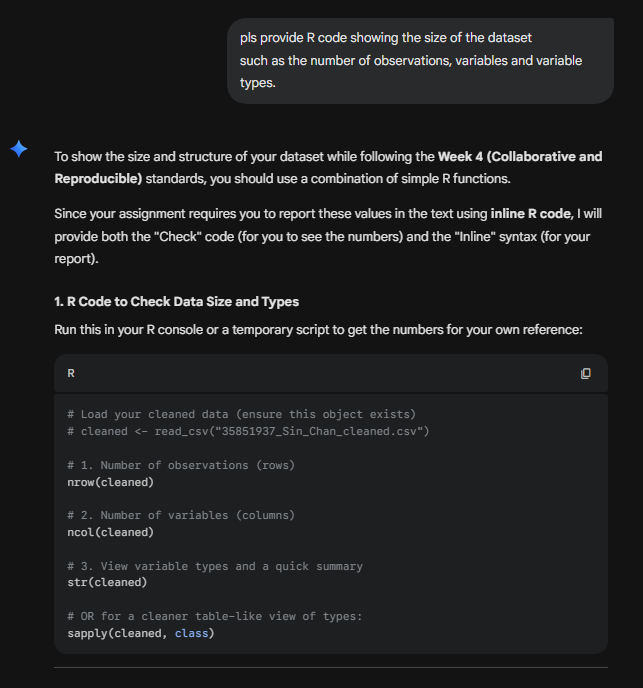
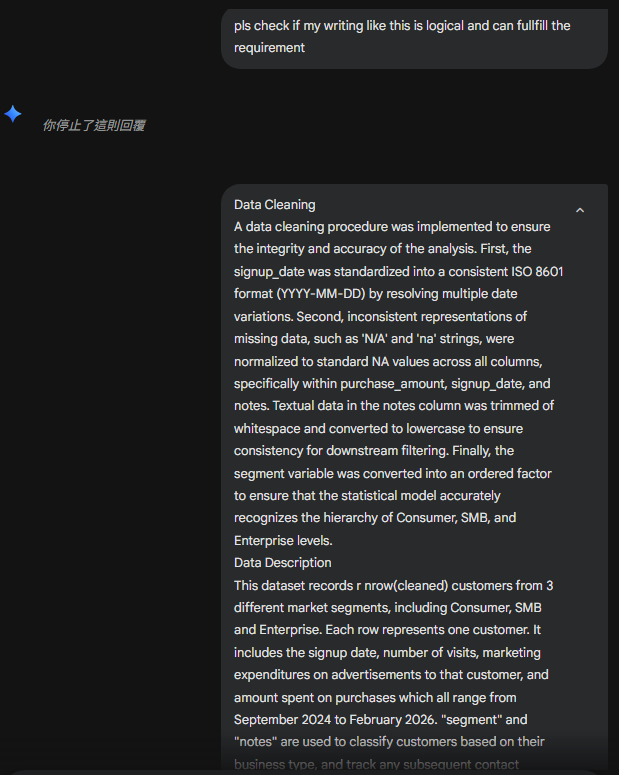
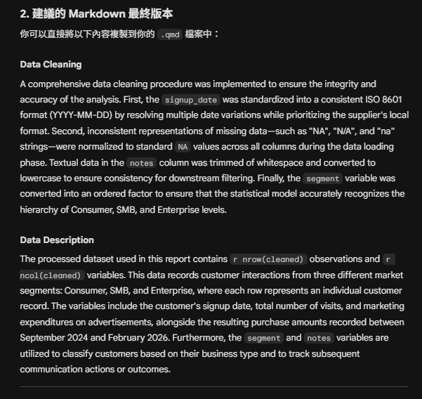
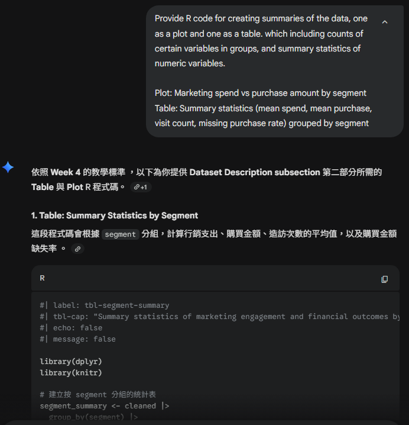
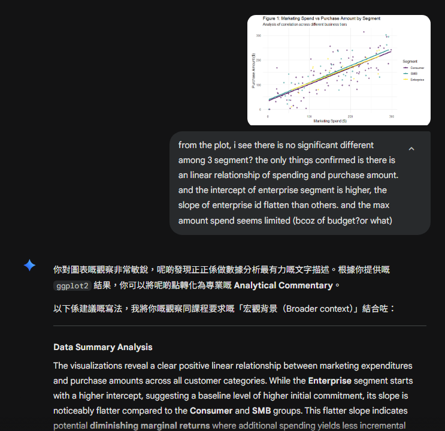
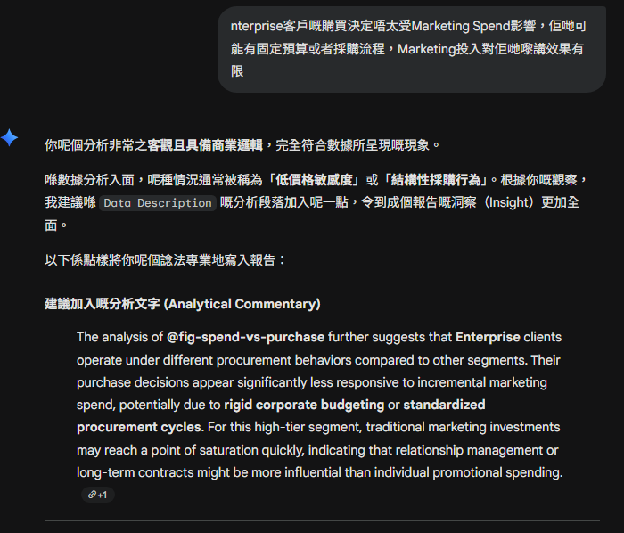
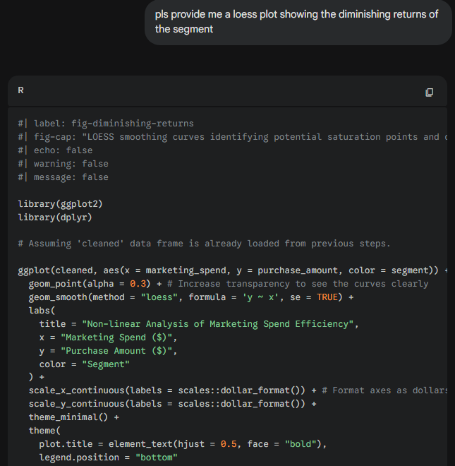
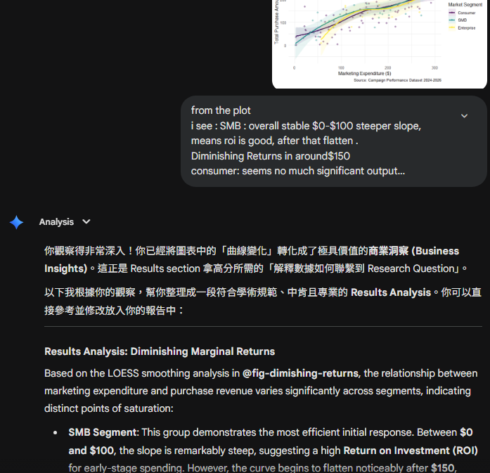
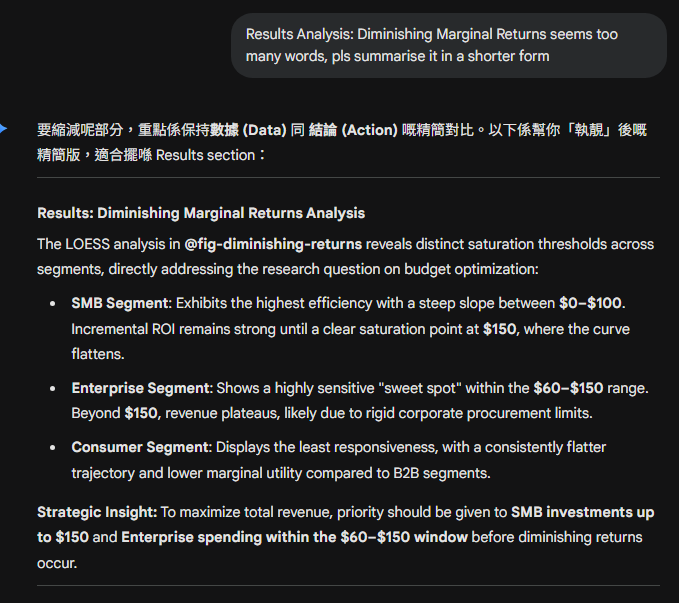
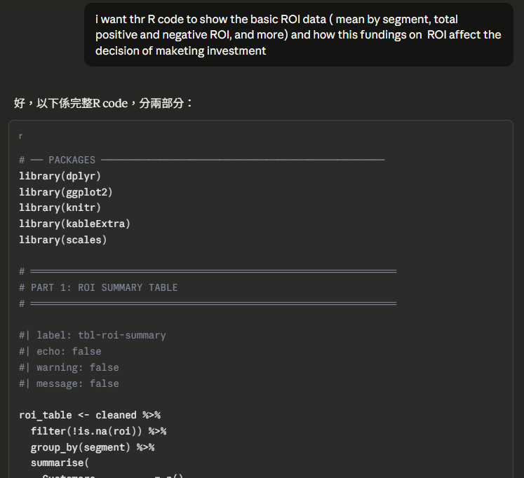

### R code for data cleaning

### Correct my tone and english writing in Dataset Introduction section git code for pushing, and check whether my writing is alligned to my code

### R code for data size

### Correct my tone and english writing in Dataset Introduction section 

-----

### R code for Dataset summaries (plot and table)

-----

#### Transform my ideas about the plot and table into a report writing style. 

------

### R code for Result ( LOESS plot)

#### Transform my ideas about the plot and table into a report writing style. 

### R code for analysing ROI data

